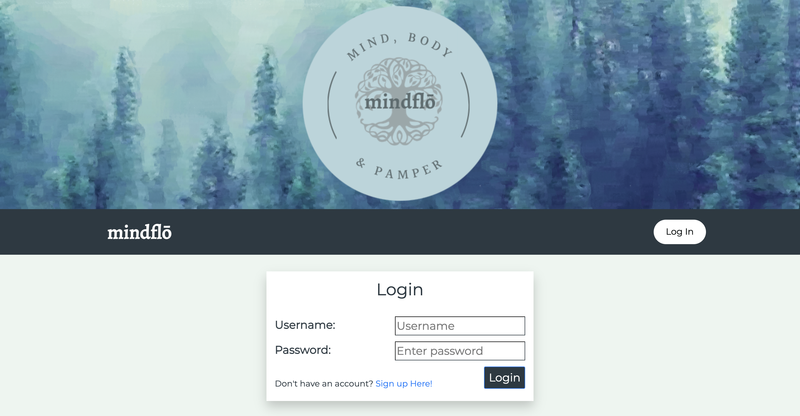
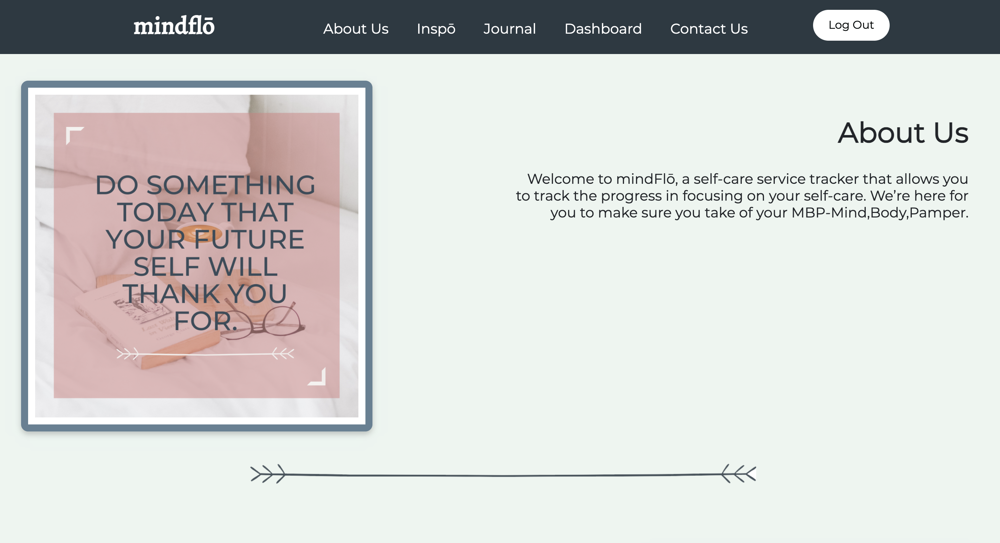
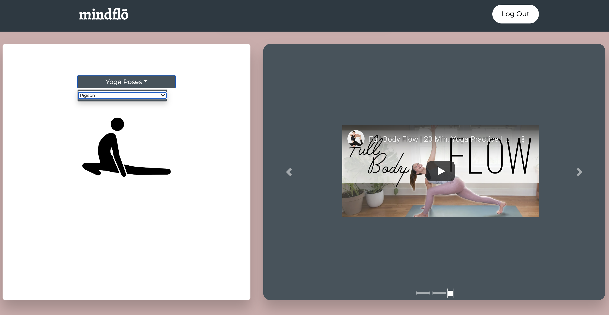
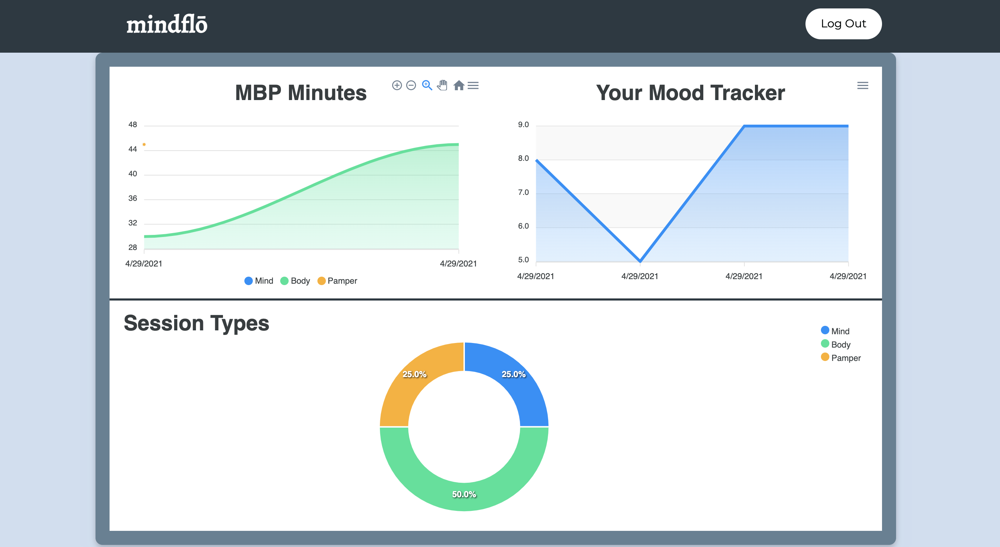
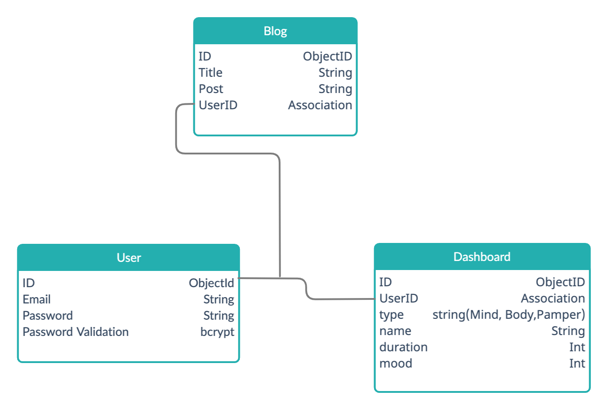

# Mindflō


## Table of Contents

  * [Description](#description)
  * [Installation](#installation)
  * [Usage](#usage)
  * [Screenshots](#screenshots)
  * [Contribution](#contribution)
  * [License](#license)


## Description

Welcome to mindFlō, a self-care service tracker that allows you to track the progress in focusing on your self-care. We’re here for you to make sure you take of your MBP. 
* Mind 
* Body 
* Pamper 

LINK IS HERE
https://mindflo.herokuapp.com/


Deployed Link: 

## Installation

To begin, I had to install my dependencies that are to be utlizied :

```
npm i
```
 * axios
 * apexcharts
 * bootstrap
 * bcryptjs
 * body-parser
 * concurrently
 * cookie-parser
 * cors
 * dotenv
 * express
 * express-session
 * if-env
 * jquery
 * jsonwebtoken
 * moment
 * mongoose
 * multer
 * nodemon
 * passport
 * passport-local
 * popper.js
 * react-icons
 * styled-components
 * uuid
 * email.js
 * emailjs-com
 * react
 * react-apexcharts
 * react-bootstrap
 * react-dom
 * react-router
 * react-router-dom
 * react-scripts
 * react-scroll
 * web-vitals


## Usage

To launch this application to Localhost:3001 please enter the following:

```
Node server.js

npm start
```
## Screenshots








Flow Chart


ERD Chart




## Contribution

1.  Rachel Wanke - https://github.com/rwanke14
2.  Young Ji Kim - Lead - https://github.com/youjmi
3.  Frankie Rosado - https://github.com/Franciscorosado09


## License 
[](https://opensource.org/licenses/MIT)


